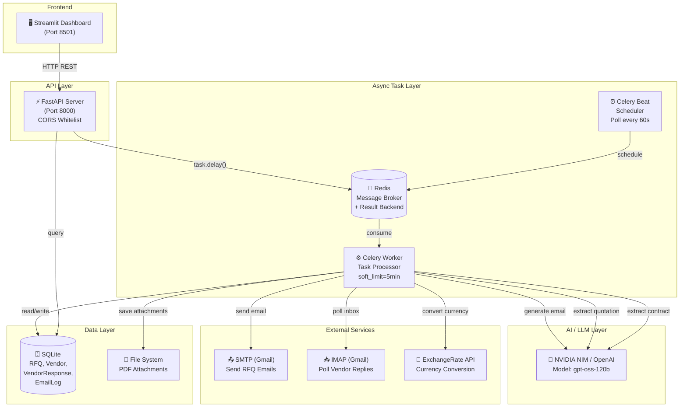
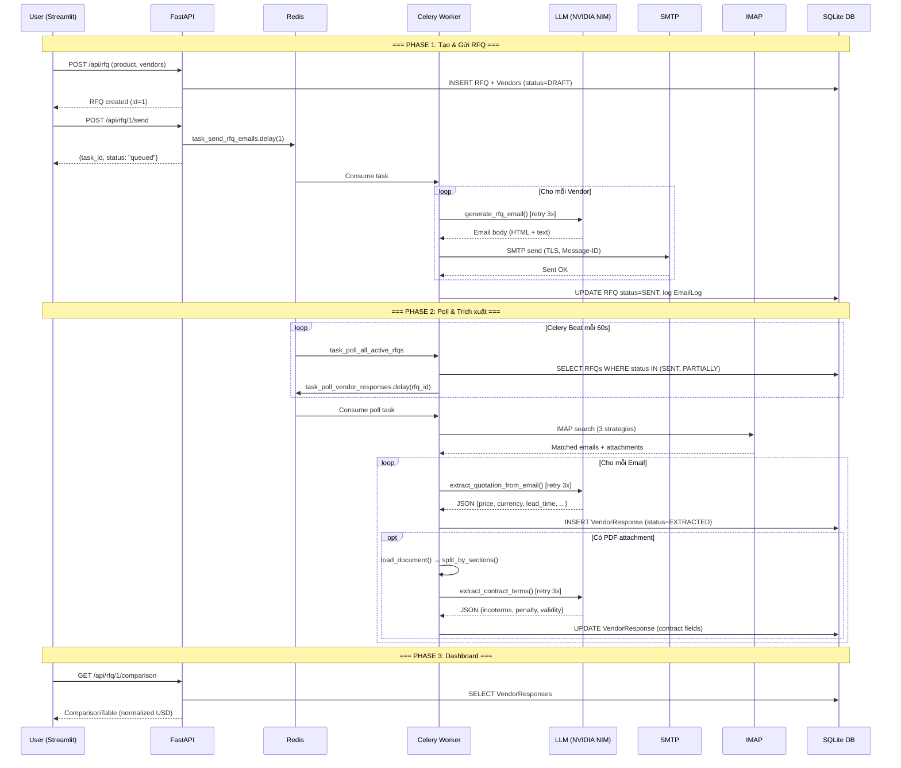
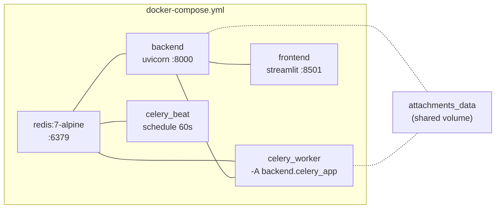
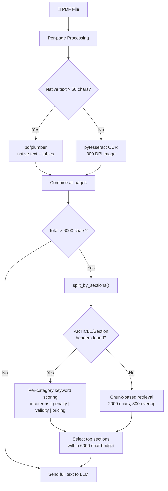

# AI-Powered RFQ Automation System

Hệ thống tự động hóa quy trình **Request for Quotation (RFQ)** cho doanh nghiệp Logistics B2B, tích hợp AI (LLM) để tạo email, trích xuất dữ liệu từ email/PDF vendor, và hiển thị bảng so sánh báo giá trên Dashboard.

---

## Mục lục

- [System Architecture](#system-architecture)
- [AI Pipeline & Error Handling](#ai-pipeline--error-handling)
- [Technology Trade-offs](#technology-trade-offs)
- [Project Structure](#project-structure)
- [Setup & Deployment](#setup--deployment)
- [API Endpoints](#api-endpoints)
- [Workflow](#workflow)

---

## System Architecture

### Tổng quan kiến trúc



### Chi tiết luồng xử lý Async



### Docker Services



| Service | Image | Port | Vai trò |
|---------|-------|------|---------|
| **redis** | redis:7-alpine | 6379 | Message broker + result backend cho Celery |
| **backend** | python:3.11-slim | 8000 | FastAPI server, REST API, DB management |
| **celery_worker** | python:3.11-slim | — | Xử lý background tasks (email, AI extraction) |
| **celery_beat** | python:3.11-slim | — | Scheduler: poll email vendor mỗi 60s |
| **frontend** | python:3.11-slim | 8501 | Streamlit UI: tạo RFQ, xem dashboard |

---

## AI Pipeline & Error Handling

### Pipeline AI — 3 điểm gọi LLM

```mermaid
graph TD
    subgraph "1️⃣ Email Generation"
        A1["Input: RFQ details + vendor info"]
        A2["LLM Call<br/>temp=1.0, max_tokens=800<br/>retry 3x, backoff 2-10s"]
        A3["Output: HTML + plaintext email"]
        A4["Fallback: Template email"]
        A1 --> A2
        A2 -->|"Success"| A3
        A2 -->|"3x Failed"| A4
    end

    subgraph "2️⃣ Quotation Extraction"
        B1["Input: Email body raw text"]
        B2["LLM Call<br/>temp=0.1, max_tokens=1024<br/>reasoning_effort=high<br/>retry 3x"]
        B3["JSON Parse + Validate"]
        B4["Output: price, currency,<br/>lead_time, payment_terms,<br/>confidence_score"]
        B5["_get_llm_text fallback:<br/>extract from reasoning field"]
        B1 --> B2
        B2 -->|"content != null"| B3
        B2 -->|"content == null"| B5
        B5 --> B3
        B3 --> B4
    end

    subgraph "3️⃣ Contract Extraction"
        C1["Input: PDF text"]
        C2{"Doc > 6000 chars?"}
        C3["split_by_sections<br/>Per-category keyword scoring"]
        C4["Full document"]
        C5["LLM Call<br/>temp=0.1, max_tokens=800<br/>retry 3x"]
        C6["Output: incoterms,<br/>penalty_clause, validity"]
        C1 --> C2
        C2 -->|"Yes"| C3
        C2 -->|"No"| C4
        C3 --> C5
        C4 --> C5
        C5 --> C6
    end
```



### Smart Document Processing (PDF)



### Error Handling Strategy

| Layer | Cơ chế | Chi tiết |
|-------|--------|----------|
| **LLM Calls** | `tenacity @retry` | 3 attempts, exponential backoff (2-10s), catch `JSONDecodeError`, `KeyError`, `ValueError`, `AttributeError` |
| **Email Generation** | Retry + Fallback | 3x retry LLM → template email nếu vẫn fail |
| **NVIDIA NIM content=null** | `_get_llm_text()` | Khi `reasoning_effort="high"`, LLM có thể trả `content=null`. Hệ thống extract JSON từ `reasoning` field |
| **Celery Tasks** | `bind=True, max_retries=2` | Retry sau 30s, `task_acks_late=True` (retry nếu worker crash) |
| **Task Timeout** | `soft_time_limit=300s` | Soft limit 5 phút (raise exception), hard kill 6 phút |
| **IMAP Polling** | 3-strategy search | Subject match + Sender whitelist + RFC threading — mỗi strategy độc lập |
| **Currency Conversion** | API + Fallback rates | Live API → hardcoded rates (EUR, GBP, JPY, CNY, KRW, VND) |
| **SMTP** | Catch per-vendor | Log + continue, không block vendor khác |
| **JSON Cleaning** | `_clean_llm_json()` | Strip markdown fences, tìm `{...}` đầu tiên, handle trailing commas |

---

## Technology Trade-offs

### 1. FastAPI vs Django/Flask

| Tiêu chí | FastAPI ✅ | Django | Flask |
|-----------|-----------|--------|-------|
| **Async support** | Native async/await | Cần ASGI adapter | Không native |
| **Auto docs** | Swagger + ReDoc tự động | Cần DRF + drf-spectacular | Cần flask-restx |
| **Validation** | Pydantic tích hợp sẵn | Serializers riêng | Cần marshmallow |
| **Performance** | Nhanh hơn 2-3x Flask | Chậm hơn FastAPI | Trung bình |

> **Trade-off**: FastAPI thiếu ORM/admin panel built-in như Django, nhưng với scope 8 endpoints + 4 models, sự nhẹ nhàng và async native là ưu tiên hàng đầu.

### 2. Celery + Redis vs RabbitMQ / Background Threads

| Tiêu chí | Celery + Redis ✅ | RabbitMQ | asyncio tasks |
|-----------|-------------------|----------|---------------|
| **Setup** | 1 container Redis | Cần management UI | Không cần broker |
| **Persistence** | Redis có persistence | Native persistent | Mất khi restart |
| **Monitoring** | Flower, task tracking | Management UI | Không có |
| **Beat scheduler** | Built-in | Cần plugin | Cần APScheduler |
| **Retry/DLQ** | `max_retries`, `task_acks_late` | Native DLQ | Tự implement |

> **Trade-off**: Redis đơn giản hơn RabbitMQ, không cần exchange/queue config. `task_acks_late=True` đảm bảo task không mất khi worker crash.

### 3. SQLite vs PostgreSQL

| Tiêu chí | SQLite ✅ | PostgreSQL |
|-----------|----------|------------|
| **Deployment** | Zero config, file-based | Cần container riêng |
| **Concurrency** | WAL mode, ok cho read-heavy | Full MVCC |
| **Migration** | SQLAlchemy abstraction — swap dễ | Production-grade |

> **Trade-off**: SQLite phù hợp cho PoC. SQLAlchemy ORM cho phép swap sang PostgreSQL chỉ bằng thay `DATABASE_URL`, không đổi code.

### 4. NVIDIA NIM vs OpenAI Direct

| Tiêu chí | NVIDIA NIM ✅ | OpenAI Direct |
|-----------|--------------|---------------|
| **Model** | `gpt-oss-120b` (open-source) | GPT-4o, GPT-4-turbo |
| **Cost** | Miễn phí (NIM trial) | Trả tiền theo token |
| **API compat** | OpenAI SDK compatible | Native |
| **Privacy** | Self-hosted option | Data gửi cloud |

> **Trade-off**: NIM dùng OpenAI SDK → swap model chỉ đổi `OPENAI_BASE_URL` + `OPENAI_MODEL`. Quirk: `reasoning_effort="high"` có thể trả `content=null` → cần fallback handler.

### 5. Streamlit vs React/Vue

| Tiêu chí | Streamlit ✅ | React/Vue |
|-----------|-------------|-----------|
| **Dev speed** | 1 file Python | Multi-file, build step |
| **Interactivity** | Server-rendered | Client-side SPA |
| **Real-time** | Polling-based | WebSocket native |

> **Trade-off**: Streamlit prototype nhanh (1 file `app.py`), đủ cho dashboard. Nếu cần real-time task tracking → upgrade React + WebSocket.

### 6. pdfplumber + OCR vs Cloud PDF Services

| Tiêu chí | pdfplumber + pytesseract ✅ | AWS Textract / Azure |
|-----------|----------------------------|----------------------|
| **Cost** | Miễn phí, offline | Pay-per-page |
| **Accuracy** | Tốt cho text-based, OCR cho scanned | Cao hơn cho complex layouts |
| **Privacy** | Data không rời server | Data gửi cloud |

> **Trade-off**: Hybrid approach (native text → OCR fallback) xử lý cả PDF text lẫn scanned. Article-based splitting giảm context gửi LLM, tiết kiệm token.

---

## Project Structure

```
rfq-automation/
├── backend/
│   ├── api/
│   │   └── rfq.py              # 8 REST endpoints + task status
│   ├── services/
│   │   ├── ai_extractor.py     # 3 LLM calls: email gen, quotation, contract
│   │   ├── currency_converter.py  # ExchangeRate API + fallback rates
│   │   ├── document_loader.py  # PDF loading, OCR, article splitting
│   │   ├── email_receiver.py   # IMAP polling, 3-strategy search
│   │   ├── email_sender.py     # SMTP sending, RFC 2822 threading
│   │   └── rfq_service.py      # Business logic orchestrator
│   ├── tasks/
│   │   └── email_tasks.py      # 3 Celery tasks (send, poll, beat)
│   ├── celery_app.py           # Celery config + beat schedule
│   ├── config.py               # Pydantic Settings (env vars)
│   ├── database.py             # SQLAlchemy engine + session
│   ├── main.py                 # FastAPI app + CORS + startup
│   ├── models.py               # 4 models: RFQ, Vendor, VendorResponse, EmailLog
│   └── schemas.py              # Pydantic request/response schemas
├── frontend/
│   └── app.py                  # Streamlit 3-page dashboard
├── mock_data/
│   ├── sample_contract.py      # Script tạo PDF hợp đồng mẫu
│   └── vendor_emails.md        # Template email vendor để test
├── .env.example                # Template environment variables
├── docker-compose.yml          # 5 services: redis, backend, worker, beat, frontend
├── Dockerfile                  # Python 3.11-slim + system deps
├── requirements.txt            # Python dependencies
└── README.md
```

---

## Setup & Deployment

### Prerequisites

- Docker Desktop
- Gmail App Password (cho SMTP/IMAP)

### 1. Clone & Configure

```bash
git clone <repo-url>
cd rfq-automation
cp .env.example .env
# Điền các giá trị trong .env
```

### 2. Các biến môi trường chính (`.env`)

| Biến | Mô tả | Ví dụ |
|------|--------|-------|
| `OPENAI_API_KEY` | API key cho LLM | `nvapi-xxx` |
| `OPENAI_BASE_URL` | LLM endpoint | `https://integrate.api.nvidia.com/v1` |
| `OPENAI_MODEL` | Model name | `openai/gpt-oss-120b` |
| `SMTP_HOST` | SMTP server | `smtp.gmail.com` |
| `SMTP_PASSWORD` | Gmail App Password | `xxxx xxxx xxxx xxxx` |
| `IMAP_HOST` | IMAP server | `imap.gmail.com` |
| `IMAP_PASSWORD` | Gmail App Password | `xxxx xxxx xxxx xxxx` |
| `CELERY_BROKER_URL` | Redis broker | `redis://redis:6379/0` |

### 3. Build & Run

```bash
docker-compose up -d --build
```

### 4. Access

| Service | URL |
|---------|-----|
| **Frontend (Dashboard)** | http://localhost:8501 |
| **Backend (Swagger UI)** | http://localhost:8000/docs |
| **API Base** | http://localhost:8000/api |

---

## API Endpoints

| Method | Endpoint | Mô tả | Response |
|--------|----------|--------|----------|
| `POST` | `/api/rfq` | Tạo RFQ mới + vendors | RFQ object |
| `GET` | `/api/rfq` | Danh sách tất cả RFQ | RFQ[] |
| `GET` | `/api/rfq/{id}` | Chi tiết RFQ + vendors + responses | RFQDetail |
| `POST` | `/api/rfq/{id}/send` | Gửi email (async) | `{task_id, status}` |
| `POST` | `/api/rfq/{id}/poll` | Poll phản hồi (async) | `{task_id, status}` |
| `GET` | `/api/rfq/{id}/comparison` | Bảng so sánh vendor | ComparisonTable |
| `GET` | `/api/rfq/{id}/responses` | Danh sách phản hồi | VendorResponse[] |
| `GET` | `/api/task/{task_id}` | Trạng thái Celery task | `{task_id, status, result?}` |

---

## Workflow

1. **Tạo RFQ** → Nhập thông tin shipment + vendors trên Streamlit
2. **Gửi Email** → Click "Send Emails" → Celery worker tạo email bằng LLM + gửi SMTP
3. **Tự động Poll** → Celery Beat poll IMAP mỗi 60s, tìm email vendor phản hồi
4. **AI Extraction** → LLM trích xuất giá, thời gian, điều khoản từ email + PDF đính kèm
5. **So sánh** → Dashboard hiển thị bảng so sánh (đã convert USD), highlight vendor tốt nhất
